# Lumina RAG

> **Self-hosted document Q&A.** Upload PDFs, DOCX, TXT, CSV, or Markdown — ask questions in natural language — get answers with citations to the exact source passages.

Built as a single Laravel monolith with a Vue 3 single-page frontend. Stores both relational data and vector embeddings in **PostgreSQL + pgvector** (no separate vector database). Supports **OpenAI** and **Ollama** as interchangeable embedding + LLM providers — bring your own API key, or run everything locally.

---

## Why

Most RAG systems are notebooks, scripts, or thin wrappers around a vendor API. Lumina is a **complete, deployable application** — multi-user auth, document lifecycle, chat sessions with history, observable async processing, runtime-tunable RAG settings, and a polished web UI. Drop it on a server and your team can start asking questions about their documents the same day.

---

## Features

- 📄 **Document ingestion pipeline** — upload → text extraction (PDF / DOCX / TXT / CSV / MD) → chunking → batch embedding → vector store. Async via Laravel queue, automatically retried on failure.
- 💬 **Chat with sources** — every answer comes with the chunks it was based on, including document title, page number, and similarity score. Streaming responses with a Stop button.
- 🔍 **Hybrid search by default** — combines vector cosine similarity with PostgreSQL full-text search, optionally re-ranked by Maximal Marginal Relevance (MMR) to reduce redundancy. Optional LLM-based query expansion.
- 🎛️ **Runtime-tunable** — every RAG knob (chunk size, similarity threshold, top-K, search mode, etc.) is editable from the Settings page without redeploying.
- 🤖 **Pluggable AI providers** — OpenAI and Ollama both implemented for embedding and LLM independently. Mix and match per-document via the AI Models registry.
- 👥 **Multi-user with API tokens** — register, login, per-user document and session ownership. Tokens are 80-char hex, sent as `Authorization: Bearer`.
- 🧹 **Real-world UI** — search, sort, filter, pagination, bulk select, optimistic confirms, toast notifications, skeleton loaders, full keyboard accessibility, mobile-responsive header.

---

## Tech stack

| Layer | Choice |
|-------|--------|
| Backend | **Laravel 13** (PHP 8.3+) — 7 internal modules with strict service contracts |
| Database | **PostgreSQL 16** + **pgvector 0.6+** — relational data and vectors in the same store |
| Cache / queue / sessions | **Redis** (recommended); database fallback |
| AI | **Ollama** (`nomic-embed-text:latest`, `all-MiniLM-L6-v2`, `mxbai-embed-large`) and optionally **OpenAI** (configurable via AiModel registry) |
| Document parsing | `smalot/pdfparser`, `phpoffice/phpword` |
| Frontend | **Vue 3** (Composition API + TypeScript) + **Pinia** + **vue-router** |
| Styling | **Tailwind v4** with a centralized `@theme` design-token system |
| Build | **Vite 8** |
| Testing | **Pest 4** (Feature + Unit) — SQLite `:memory:` test DB |

---

## Quick start

Prerequisites: PHP 8.3+, Composer, Node 20+, PostgreSQL 16 + pgvector, Redis (recommended), OpenAI API key (or Ollama running locally).

```bash
git clone <repo-url> && cd rag
composer run setup                       # install + .env + key + migrate + npm install + build
# Edit .env — at minimum set DB_PASSWORD and OPENAI_API_KEY
composer run dev                         # serves Laravel + queue + logs + Vite
```

Open [http://localhost:8000](http://localhost:8000), register, upload a document, ask a question.

For full setup (PostgreSQL install, pgvector, Ollama, troubleshooting), see [SETUP_GUIDE.md](SETUP_GUIDE.md).

---

## Architecture at a glance

```
┌────────────────────────────────────────────────────────┐
│                   Vue 3 SPA (resources/js/)            │
│   Chat │ Documents │ AI Models │ Settings │ Auth       │
└──────────────────────────┬─────────────────────────────┘
                           │  HTTP + SSE (Authorization: Bearer)
┌──────────────────────────▼─────────────────────────────┐
│                  Laravel 13 (modules/)                  │
│                                                         │
│  ┌─────────────┐  ┌─────────────┐  ┌────────────────┐ │
│  │ ChatModule  │  │DocumentMod. │  │ SettingsModule │ │
│  │  (RAG       │  │ (upload +   │  │ (runtime cfg + │ │
│  │   pipeline) │  │  pipeline)  │  │  AI registry)  │ │
│  └──────┬──────┘  └──────┬──────┘  └────────────────┘ │
│         │                │                              │
│  ┌──────▼────────────────▼──────┐                      │
│  │ EmbeddingModule │ LLMModule  │ ← OpenAI / Ollama    │
│  │ VectorStoreModule (pgvector) │                      │
│  └──────────────────────────────┘                      │
│                                                         │
│  UserModule (auth) — standalone                        │
└──────────────────────────┬──────────────────────────────┘
                           │
                ┌──────────▼──────────┐
                │ PostgreSQL 16       │
                │  + pgvector         │
                │  + IVFFlat index    │
                └─────────────────────┘
```

**Flow diagrams:**

```mermaid
flowchart TB
    subgraph Document["📄 Document Ingestion"]
        Upload["Upload PDF/DOCX/TXT/CSV/MD\n< 50MB"] --> Dedup["SHA-256 dedup\n→ 409 Conflict if exists"]
        Dedup --> Job["Dispatch ProcessDocumentJob\n(async queue)"]
        Job --> Extract["Extract text\nsmalot/pdfparser • phpoffice/phpword"]
        Extract --> Chunk["Recursive char splitter\n1000 chars / 200 overlap"]
        Chunk --> Embed["Batch embed via AiModel\n(100 texts/call, MD5-cached 24h)"]
        Embed --> Store["Upsert vectors to ve_{dim}\npostgres + pgvector"]
        Store --> Complete["Mark document completed"]
    end

    subgraph Query["💬 Chat / Query"]
        Ask["User asks question\nPOST /api/chat"] --> Filter["Apply filters\n(documents, date range, LLM)"]
        Filter --> QEmbed["Embed question\nEmbeddingService"]
        QEmbed --> Search["Hybrid search\nvector cosine + FTS"]
        Search --> Threshold["≥ 0.65 similarity?"]
        Threshold -- No --> Refusal["Return: I cannot answer...\n(no LLM call)"]
        Threshold -- Yes --> MMR["MMR re-rank\nλ=0.7 • deduplicate"]
        MMR --> Prompt["Build LLM prompt\ncontext + question"]
        Prompt --> LLM["LLM streams answer\nover SSE"]
        LLM --> Sources["Attach sources\n(document, page, score, excerpt)"]
        Sources --> Persist["Save chat_messages\nuser + assistant"]
    end

    subgraph Config["⚙️ Configuration"]
        direction LR
        AiModel["AiModel registry\nprovider • credentials • dims • settings<br/>active model by sort_order"] --- ConfigFile["config/rag.php\n.env overrides"]
    end

    Document -.->|"AiModel picks\nembedding provider"| Config
    Query -.->|"AiModel picks\nLLM provider"| Config
```



**Document ingestion flow (top):** Upload → SHA-256 dedup → async queue job → text extraction → chunking → batch embedding via the selected AiModel → upsert vectors → mark complete. All async via Laravel queue with automatic retries.

**Chat flow (middle):** Question → hybrid search (vector + FTS) → similarity threshold check (≥ 0.65) → MMR re-ranking → LLM prompt → streamed answer with source citations → persisted to session. If no chunks pass the threshold, the LLM is never called.

**Configuration (bottom):** `config/rag.php` is the global source of truth. Per-model overrides (search mode, top-K, MMR params, query expansion) live in the AiModel's `settings` JSONB column.

---

## Documentation

| Doc | What's in it |
|-----|--------------|
| [SETUP_GUIDE.md](SETUP_GUIDE.md) | Install, environment, run, verify, Ollama setup, troubleshooting |
| [PROJECT_STRUCTURE.md](PROJECT_STRUCTURE.md) | Module layout, frontend organization, design system, dependency graph |
| [PROJECT_ROUTES.md](PROJECT_ROUTES.md) | All API endpoints + SPA routes with payloads and response shapes |
| [BUSINESS_LOGIC.md](BUSINESS_LOGIC.md) | RAG pipeline, document lifecycle, session rules, auth, edge cases |
| [PROJECT_RULES.md](PROJECT_RULES.md) | Coding standards (typing, DI, naming, testing, module isolation) |
| [docs/DATABASE_SCHEMA.md](docs/DATABASE_SCHEMA.md) | Per-table column reference |
| [docs/DEPLOYMENT.md](docs/DEPLOYMENT.md) | Production deployment notes |
| [CLAUDE.md](CLAUDE.md) / [AGENTS.md](AGENTS.md) | AI-agent reference for working in this codebase |

---

## Project conventions

- **Strict types** on every PHP file (`declare(strict_types=1);`).
- **ULIDs everywhere** as primary keys (no auto-increment integers).
- **No DB-level FK constraints** — relationships enforced in application code (intentional; supports module isolation).
- **Service layer is the only thing that touches Models** — controllers validate and dispatch; repositories don't bypass services.
- **One Resource per route** — never share API resources between endpoints.
- **Design tokens, not raw colors** — every Vue component uses `brand-*` / `surface-*` / `success-*` / `warning-*` / `danger-*` semantic classes; raw Tailwind palette names (`blue-`, `gray-`, `red-`) don't appear in `resources/`.
- **No raw `<button>` elements** — every clickable element is a reusable component (`AppButton`, `AppConfirm`, etc.).

See [PROJECT_RULES.md](PROJECT_RULES.md) for the full list.

---

## License

See [LICENSE](LICENSE) (or contact the maintainers — there's no license file checked in yet).

---

## Acknowledgments

- [pgvector](https://github.com/pgvector/pgvector) — the extension that makes Postgres usable as a vector store.
- [Trix](https://trix-editor.org/) — rich-text editor used for document and model descriptions.
- [Laravel](https://laravel.com), [Vue](https://vuejs.org), [Tailwind CSS](https://tailwindcss.com), [Pinia](https://pinia.vuejs.org), [Pest](https://pestphp.com) — the foundation everything is built on.
